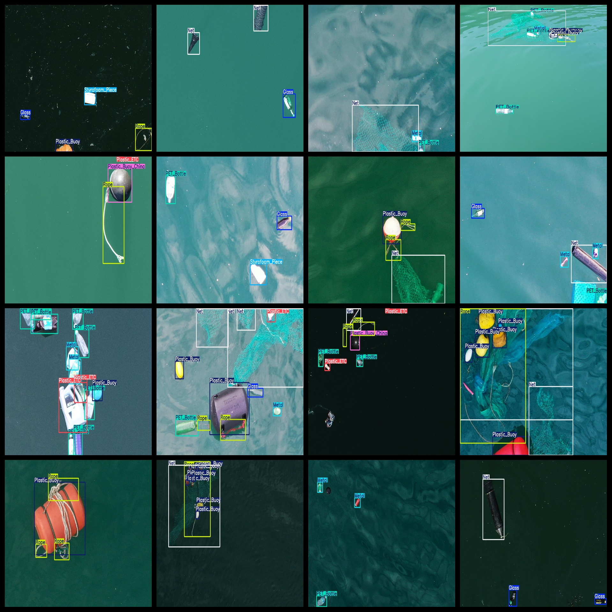
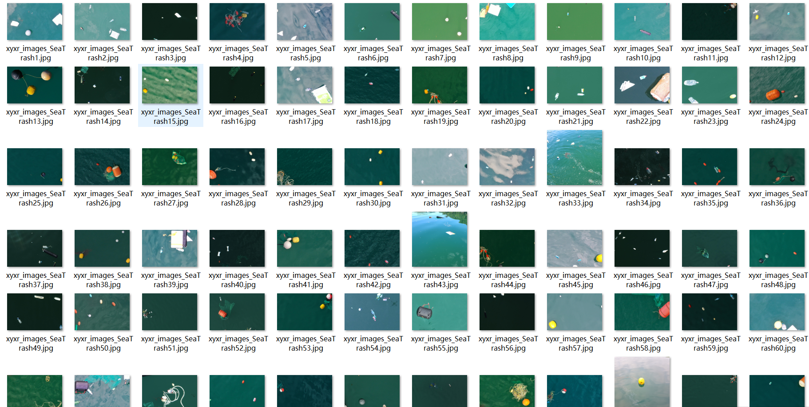

# [Object Detection] Sea Surface Garbage Dataset - 7747 Images in YOLO+VOC Format

**Target Detection**: Sea Surface Garbage Dataset - 7747 Images in YOLO+VOC Format

Dataset format: VOC + YOLO

Inside the zip file, there are three folders containing images, xml files, and txt files.

In the JPEGImages folder, there are a total of 7747 JPG images.

The Annotations folder contains a total of 7747 xml files.

The labels folder contains a total of 7747 txt files.

There are a total of 11 label types:
- Glass
- Metal
- Net
- PET Bottle
- Plastic Boat (Plastic Etc)
- Plastic Buoy (China)
- Plastic ETC
- Rope
- Styrofoam Box
- Styrofoam Buoy
- Styrofoam Piece

The Chinese translation for each label is as follows:
- Glass
- Metal
- network
- PET bottle
- Plastic buoy (China)
- Plastic buoy (Plastic equivalent)
- Rope
- Polystyrene foam box
- Plastic foam
- Polyethylene foam article

The number of boxes per label type (noting that the order of classes in the YOLO format does not match this, but rather, refer to the classes.txt in the labels folder):

- Glass: 2254
- Metal: 3389
- Net: 3236
- PET Bottle: 6183
- Plastic Boat (China): 1012
- Plastic ETC: 1669
- Rope: 5633
- Styrofoam Box: 425
- Styrofoam Buoy: 630
- Styrofoam Piece: 2154

Total boxes: 43594

Image resolution (pixel size): Clear

Image enhancement status: Yes

Label shape: Rectangular box for object detection identification.

Important Note: No guarantees are made regarding the accuracy or reasonableness of the labeled models or weights files provided in this dataset. The dataset is only available with accurate and reasonable annotations.
## Images

---

Here is a pay link on Stripe (https://buy.stripe.com/3cs8yP7sY87d0vu9AB). Please contact me lonlonago@foxmail.com after funding $89, and I will send you a complete data files, thank you!

